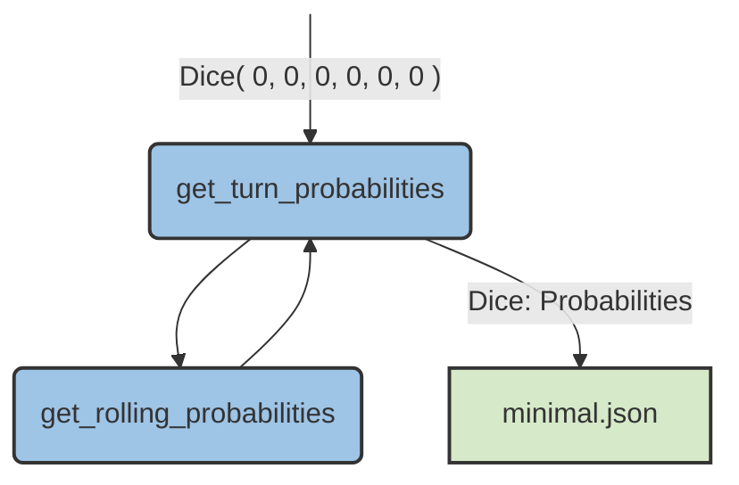

# pickomino-rl

**Optimal play, simulation, and visualizations for _Pickomino_ (a.k.a. _Heckmeck_).**  
This repo contains:

- A probability engine that precalculates the chance of reaching each tile from any dice state.
- An interactive CLI game (human vs. bots) that uses those probabilities to play and explain decisions.
- Batch simulators and plotting scripts to analyze strategy, stealing, and win rates.

If you want a gentle, high-level intro to the game and why probabilities matter, my blog post here: https://www.maartenpoirot.com/pickomino/. This project provides the explicit dynamic-programming model, caching, and tooling for that post.

If you are not familiar with the game, or are generally looking to have a good time, I can recommend checking out the React-based web implementation of the game that includes a tutorial: https://www.maartenpoirot.com/pickomino/play_pickomino_en

---

## Contents

- [Installation](#installation)
- [Quick Start](#quick-start)
- [How the model works (short version)](#how-the-model-works-short-version)
- [Interactive CLI game](#interactive-cli-game)
- [Precomputing turn chances](#precomputing-turn-chances)
- [Batch simulations & figures](#batch-simulations--figures)
- [Verification](#verification)
- [Data formats](#data-formats)
- [Folder structure](#folder-structure)
- [Key types & terms](#key-types--terms)
- [License](#license)

---

## Installation

Requires Python 3.10+. 
I've not included Seaborn and Sci-Py because they are only used in visualization. 
Here's how to craete a virtual env and install the required packages:
```bash
python -m venv .venv
source .venv/bin/activate   # Windows: .venv\Scripts\activate
pip install -r requirements.txt
```
## Quick Start

1.  **Precompute probabilities** (once).  
    These power the bots and the CLI:
`python precalculate_turn_chances.py` 

You’ll get two caches in `precalculated_chances/`:

-   `minimal.pkl` / `minimal.json` — tile is achievable if **score ≥ tile value**
    
-   `exactly.pkl` / `exactly.json` — tile (or steal) requires **score == tile value**

The Pickle (`.pkl`) files are used in the Python CLI. The JSON (`.json`) files are used in the React-based web version of the game.

2.  **Play the interactive CLI** (human vs. bots):
    

`python play_verbose_games.py` 

You’ll see the table, each roll, the legal pickups, and the bot’s computed **appeal** (its EV-like decision score). You can type which face to pick and whether to quit (take a tile) or continue.

3.  **Run a batch simulation** (non-interactive) to collect outcomes:
    

`python test_player_parameters.py` 

Results land in `play_results/single_run_outcomes/outcomes.csv`.  
Plot helpers live in `visualization_methods/`.

----------

## How the model works (short version)

Pickomino turns reduce to **states** and **decisions**:

-   A **state** is your current dice collection: counts per face `1..6`. It has:
    
    -   `score` (sum with worms), `n_free_dice`, and a serialization key `dice.key`.
        
-   A **decision** is which single face to pick after a roll (you must collect all dice of one face that are legal to collect).
    

The engine computes:

-   `get_turn_probabilities(dice) -> pd.Series`
    
    -   For the given state, returns the **optimal probability** of being able to take each tile by the end of your turn.
        
    -   Uses memoization: results are cached under `probabilities[dice.key]`.
        
-   `get_rolling_probabilities(dice) -> pd.Series`
    
    -   Enumerates all outcomes of rolling the free dice.  
        Outcomes are grouped by **frequency histogram** (to avoid recomputing permutation-equivalent rolls).
        
    -   For each histogram, it evaluates all legal pickups and keeps the **best** downstream outcome.
        
-   Base cases:
    
    -   If you can’t roll or can’t pick any face, your chance collapses to tiles that your **current score** already qualifies for.
        

Two rule sets are computed:

-   **minimal** (`score ≥ tile`) — for taking from the table.
    
-   **exactly** (`score == tile`) — for stealing opponents’ top tiles.
    

The CLI combines these with a simple **appeal** function that acts like an expected value:

-   For table tiles: `appeal = P(take tile) × (tile worm value + potential_loss)`
    
-   For steals: `appeal = P(steal tile) × (steal_weight × tile worms + potential_loss)`
    
-   `potential_loss` is the value of your own top tile (what you avoid losing if you don’t bust).
    
-   `steal_weight` defaults to `2.0` and can be varied. Other variants (e.g., reward stealing the leader) are implemented in the CLI.
    

----------

## Interactive CLI game

Run:

`python play_verbose_games.py` 

Key points:

-   **You vs. bots.** Set `human_player=True` and choose `n_players`, `n_games`, and `do_steal`.
    
-   **Readable trace.** For each turn you see:
    
    -   Current owner stacks and “Stealable” (opponents’ top tiles).
        
    -   Table tiles (with worm values).
        
    -   Each roll (`Roll: [counts per face]`), legal pickups like `2x6`, and the bot’s best **target** (`25` or `S25`) with appeal.
        
    -   When you quit, the bot prints the appeal table for all reachable tiles/steals from the final collection.
        
-   **Your inputs.**
    
    -   `Pick up:` type a face number (1..6) to collect that face.
        
    -   `Quit?` press **Enter** to quit (take a tile), or type anything to continue.
        
    -   The bot shows “Bot: Continue!! / Quit!!” when your choice differs from its recommendation.
        

Outputs:

-   A per-game winner and a final **TALLY** of wins across `n_games`.
    
-   Per-game **turn types** (0=bust, 1=pick, 2=steal) kept in memory for later analysis.
    

----------

## Precomputing turn chances

The precalculation script exhaustively fills the memo tables:

`python precalculate_turn_chances.py` 

What it writes:

-   `precalculated_chances/minimal.pkl` — dict: `state_key -> pd.Series(tile -> probability)`
    
-   `precalculated_chances/exactly.pkl` — same, but “exact match” rule (used for stealing).
    
-   JSON mirrors (`minimal.json`, `exactly.json`) with percentages (0–100, 1 decimal).
    

Implementation highlights (see `precalculate_turn_chances.py`):

-   **Dynamic programming with memoization.**
    
-   **Outcome grouping** by histogram (e.g., rolling `[1,1,2,5,5]` and `[5,5,2,1,1]` are the same).
    
-   **Optimal pickup policy**: at each roll outcome, choose the pickup that maximizes downstream tile chances.
    



----------

## Batch simulations & figures

-   `test_player_parameters.py` — run many games, vary player params (e.g., stealing multiplier).  
    Outputs `play_results/single_run_outcomes/outcomes.csv`.
    
-   `visualization_methods/`
    
    -   `vis-advantage.py` — relative advantage plots.
        
    -   `vis-completion.py` — share of turn outcomes over normalized game progress.
        
    -   `vis-mult.py` — effect of steal multiplier.
        
    -   `vis-turn.py` — per-turn visuals.
        
-   `figures/win-rates.png` — example win-rate figure.
    

----------

## Verification

Reasoning your way into calculating probabilities is one thing, another is to statistically check if your calculations are right. I therefor performed two layers of checks:

-   `verification_of_precalculated_chances/`
    
    -   `verify_target-tile.py`, `verify_target-value.py`
        
    -   Compares DP probabilities vs. simulation over many games; logs to `verification_results.txt`.
        
-   `verification_of_target_risk/`
    
    -   `verify_target-risk.py` and a summary sheet `target_risk_outcomes.xlsx`.
 
In `verification_results.txt` you can see that the statistical tests numerically confirm that the chance a tile can be obtained from the probability model lies within the 99% confidence interval of the simulated games:

| Tile | Model % | Simulated % | 99% CI Low  | 99% CI High | Status  |
|----:|-------:|------------:|--------:|--------:|:--------|
| 21  | 89.303% | 89.638%     | 89.287% | 89.989% | SUCCESS |
| 22  | 85.560% | 85.596%     | 85.192% | 86.000% | SUCCESS |
| 23  | 80.774% | 80.840%     | 80.387% | 81.293% | SUCCESS |
| 24  | 74.837% | 74.840%     | 74.340% | 75.340% | SUCCESS |
| 25  | 68.033% | 67.716%     | 67.177% | 68.255% | SUCCESS |
| 26  | 60.699% | 60.942%     | 60.380% | 61.504% | SUCCESS |
| 27  | 52.476% | 52.318%     | 51.743% | 52.893% | SUCCESS |
| 28  | 43.542% | 43.330%     | 42.759% | 43.901% | SUCCESS |
| 29  | 34.629% | 34.746%     | 34.197% | 35.295% | SUCCESS |
| 30  | 26.379% | 26.034%     | 25.529% | 26.539% | SUCCESS |
| 31  | 19.401% | 19.092%     | 18.639% | 19.545% | SUCCESS |
| 32  | 13.581% | 13.566%     | 13.172% | 13.960% | SUCCESS |
| 33  |  8.678% |  8.690%     |  8.366% |  9.014% | SUCCESS |
| 34  |  5.262% |  5.390%     |  5.130% |  5.650% | SUCCESS |
| 35  |  2.891% |  2.812%     |  2.622% |  3.002% | SUCCESS |
| 36  |  1.568% |  1.580%     |  1.436% |  1.724% | SUCCESS |

----------

## Data formats

### Probability caches

-   **Pickled dicts** (`.pkl`):
    
    -   Keys: `dice.key` (a serializable tuple of face counts for the current collection).
        
    -   Values: `pd.Series`, index = tile values (e.g., `21, 22, …`) with probabilities in `[0,1]`.
        
-   **JSON exports** (`.json`):
    
    -   Same mapping but converted to percentages (0–100, one decimal), with state keys serialized as strings.
        

### Legacy state files (historical)

-   `states_old.pkl`  
    Keys are **all collections** with 8 dice. Values list **all possible rolls** from that state  
    (e.g., 1287 rolls from `(0,0,0,0,0,0)`; `0` from terminal `(8,0,0,0,0,0)`).
    
-   `states_all.pkl`  
    Improves by storing only rolls whose counts **sum with the key to 8**; `(0,0,0,0,0,0)` is replaced by `None`.
    
-   `states_valid.pkl`  
    Like `states_all.pkl`, but values contain only **valid pickups** (e.g., from `(0,0,4,4,0,0)` removing `(0,0,2,0,0,0)` which is illegal).
    

----------

## Folder structure
```
.
├─ figures/
│  └─ win-rates.png
├─ play_results/
│  └─ single_run_outcomes/
│     └─ outcomes.csv
├─ precalculated_chances/
│  ├─ exactly.json
│  ├─ exactly.pkl
│  ├─ minimal.json
│  └─ minimal.pkl
├─ verification_of_precalculated_chances/
│  ├─ single_run_outcomes/
│  ├─ verification_results.txt
│  ├─ verify_target-tile.py
│  └─ verify_target-value.py
├─ verification_of_target_risk/
│  ├─ target_risk_outcomes.xlsx
│  └─ verify_target-risk.py
├─ visualization_methods/
│  ├─ vis-advantage.py
│  ├─ vis-completion.py
│  ├─ vis-mult.py
│  └─ vis-turn.py
├─ LICENSE
├─ play_verbose_games.py # Interactive CLI (human vs. bots) 
├─ precalculate_turn_chances.py # Builds minimal/exactly caches 
├─ README.md # (this file) 
├─ test_player_parameters.py # Batch sim to CSV └─ utils.py # Dice, Tiles, Player/Players, IO helpers` 
```
**Where things are used**

-   **Game / Bots:** `play_verbose_games.py` + `utils.py` + `precalculated_chances/*.pkl`
    
-   **Precompute:** `precalculate_turn_chances.py` → writes `precalculated_chances/`
    
-   **Analyze:** `test_player_parameters.py` → `play_results/...`
    
-   **Visualize:** scripts in `visualization_methods/`
    
-   **Verify:** scripts in `verification_of_*`
    

----------

## Key types & terms

-   **Tiles** — pickable values `21..36`, each with a **worm value** (1–4).
    
-   **Steal** — take an opponent’s top tile if your final score equals it (`exactly` rule).
    
-   **Dice state / collection** — counts of faces `1..6` that you’ve set aside this turn.  
    `Dice()` exposes: `n_faces`, `n_dice`, `n_free_dice`, `free_dice`, `free_faces`, `score`, `key`, and numpy-like indexing.
    
-   **Appeal (EV surrogate)** — selection score used by bots:
    
    -   Table pick: `P(tile) × (worms + potential_loss)`
        
    -   Steal: `P(steal) × (steal_weight × worms + potential_loss)`
        
-   **Turn types** — encoded outcomes per turn: `0=bust`, `1=pick`, `2=steal`.